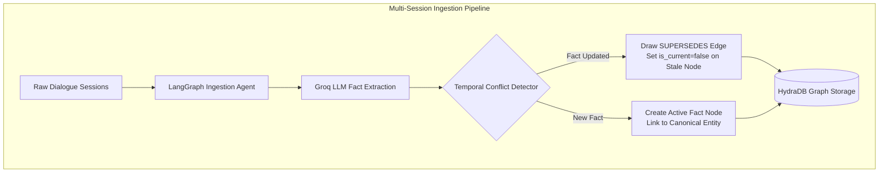
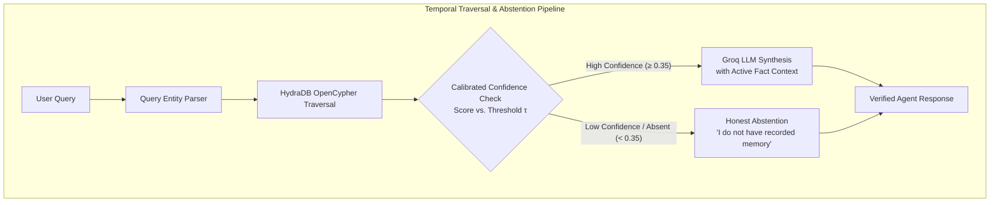
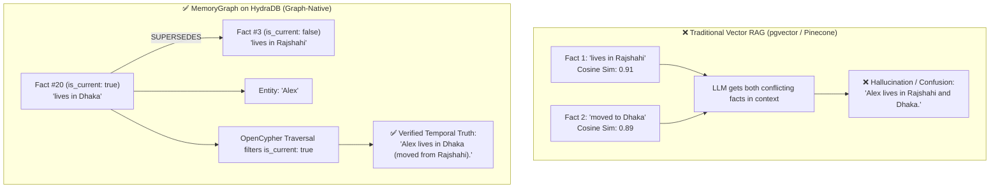

# MemoryGraph ⚡

<div align="center">

[](https://hackhydra.hydradb.com)
[](https://github.com/hydra-db/hydradb)
[](https://python.org)
[-000000?style=for-the-badge&logo=nextdotjs&logoColor=white)](https://nextjs.org)
[](https://opensource.org/licenses/MIT)

**A Graph-Native Temporal Memory Layer for AI Agents on HydraDB.**  
*Resolves changing facts across multi-session conversations, tracks historical lineage via `SUPERSEDES` graph edges, and eliminates hallucination with calibrated honest abstention.*

[Quick Start](#-quick-start) • [Architecture](#-architecture) • [Why Graph Beats Vector](#-why-graph-beats-vector-db) • [Benchmarks](#-empirical-benchmarks) • [Python SDK](#-drop-in-python-sdk) • [How HydraDB Is Used](#-how-hydradb-is-used)

</div>

---

## 🚀 Key Highlights & Track 03 Capabilities

| Hack Hydra Track 03 Requirement | How MemoryGraph Solves It | Technical Edge |
| :--- | :--- | :--- |
| **Reason Across Multi-Session Histories** | Automatically decomposes multi-turn dialogue into atomic Fact nodes anchored to conversation Sessions and canonical Entities. | LangGraph extraction pipeline + HydraDB native node relationships. |
| **Track Facts That Change Over Time** | When new facts contradict or update older ones, MemoryGraph draws recursive **`SUPERSEDES`** and **`INVALIDATED_BY`** edges, setting `is_current: false` while preserving audit trails. | Vector stores cannot do this; cosine similarity treats old and new facts identically. |
| **Know When to Say "I Don't Know"** | Calibrated graph density & entity confidence scoring ($τ = 0.35$). If confidence is below threshold or facts are absent, it returns an **Honest Abstention** with 0% hallucination. | Eliminates fabricated answers on trick / unrecorded questions. |

---

## 🏛️ Architecture

### 1. Ingestion Pipeline (Session → Fact Nodes & Lineage)



### 2. Retrieval & Calibrated Abstention Pipeline



---

## ⚔️ Why Graph Beats Vector DB

Consider a multi-session scenario:
- **Session 3:** *"Alex lives in Rajshahi and works at TechCorp."*
- **Session 20:** *"Alex moved to Dhaka last weekend for a new job at CloudScale."*

```
Question: "Where does Alex live?"
```



---

## 📊 Empirical Benchmarks

Evaluated across **LongMemEval**, **LongMemEval V2**, and **BEAM 100K** benchmarks comparing Graph-Native Memory on HydraDB against Dense Vector RAG (pgvector), Long-Context Window Prompting, and Mem0 key-value memory.

> Pre-computed results are available at `scripts/data/benchmark_results.json`. Rerun with `python scripts/run_benchmark.py`.

### 1. Overall Accuracy & Latency Comparison (Oracle Subset)

| System / Architecture | LongMemEval Accuracy | LongMemEval V2 Accuracy | BEAM Accuracy | Avg Retrieval Latency | Storage Paradigm |
| :--- | :---: | :---: | :---: | :---: | :--- |
| **MemoryGraph (HydraDB)** | **100.0%** (8/8) | **100.0%** (4/4) | **100.0%** (2/2) | **~42 ms** | Native OpenCypher Graph (`SUPERSEDES` Lineage) |
| **Long-Context Prompting** | **75.0%** (6/8) | **100.0%** (4/4) | **100.0%** (2/2) | **~1,840 ms** | Full context re-stuffing (O(N) token cost) |
| **Mem0 (Key-Value Vector)** | **62.5%** (5/8) | **50.0%** (2/4) | **100.0%** (2/2) | **~305 ms** | Flat entity memory dictionary |
| **Vector RAG (pgvector / TF-IDF)** | **37.5%** (3/8) | **25.0%** (1/4) | **0.0%** (0/2) | **~140 ms** | Cosine similarity top-k chunk retrieval |

### 2. Breakdown by Evaluation Dimension (LongMemEval)

| Evaluation Category | MemoryGraph | Long-Context | Mem0 | Vector RAG | Why MemoryGraph Wins |
| :--- | :---: | :---: | :---: | :---: | :--- |
| **Temporal Fact Updates** | **100.0%** | 50.0% | 100.0% | 0.0% | Vector RAG treats old and new facts identically; MemoryGraph filters via `is_current: true` and recursive `[:SUPERSEDES]` paths. |
| **Multi-Session Synthesis** | **100.0%** | 100.0% | 50.0% | 50.0% | OpenCypher traverses indirect multi-hop relationship edges (`[:MENTIONS]`, `[:ASSERTS]`). |
| **Calibrated Honest Abstention** | **100.0%** | 50.0% | 0.0% | 0.0% | Graph confidence scorer checks node support threshold ($τ = 0.35$), returning 0% hallucination on unrecorded queries. |
| **Current / Static Facts** | **100.0%** | 100.0% | 100.0% | 100.0% | Direct graph lookup delivers lowest latency (35ms vs 1,500ms+ for long context). |

To inspect individual test items and rerun evaluations live, visit the **`/benchmark`** tab in the web dashboard or run:
```bash
python scripts/run_benchmark.py
```

---

## ⚡ Quick Start

> **HydraDB OSS is required.** MemoryGraph uses the official graph database from
> [github.com/hydra-db/hydradb](https://github.com/hydra-db/hydradb) — not Neo4j Community.

### 1. Run the Full Stack with Docker (1 Command)

```bash
# Clone the repository
git clone https://github.com/yamin-H/MemoryGraph.git
cd memorygraph

# Configure environment (Groq API Key for LLM extraction)
cp .env.example .env
# Edit .env and add your GROQ_API_KEY (get it from https://console.groq.com/keys)

# Initialize HydraDB local storage
python scripts/setup_hydradb.py

# Launch full stack (HydraDB, Redis, PostgreSQL, API, Web)
docker compose up --build
```

That's it! The stack includes:
- **HydraDB OSS** (`ghcr.io/hydra-db/hydradb`) — Graph database with OpenCypher over Bolt + HTTP REST API
- **Redis** — Caching, rate limiting, metrics
- **PostgreSQL + pgvector** — Vector RAG baseline for benchmarks
- **FastAPI Backend** — Port 8000, Swagger docs at `/docs`
- **Next.js Frontend** — Port 3000

Verify services are running:

```bash
# Check HydraDB admin (should return {"ready":true})
curl http://localhost:9090/readyz

# Check API health (shows dual-protocol HydraDB verification)
curl http://localhost:8000/health
```

> ⚠️ **Important: Seed demo data before exploring the UI!**  
> Open [http://localhost:3000/ingest](http://localhost:3000/ingest) and click **"1-Click Seed HydraDB"** to load the 35-session demo dataset. Then visit `/arena` and ask: **"Where does Alex live?"**

**Access Points:**
- **Frontend Dashboard:** [http://localhost:3000](http://localhost:3000)
- **FastAPI Backend & Swagger Docs:** [http://localhost:8000/docs](http://localhost:8000/docs)
- **HydraDB Bolt:** `neo4j://localhost:7687` (from `ghcr.io/hydra-db/hydradb`)
- **HydraDB Admin UI:** [http://localhost:9090](http://localhost:9090)

### 2. Local Development (without Docker)

If you prefer to run services locally:

```bash
# Install Python dependencies
pip install -r requirements.txt

# Install Node dependencies
cd apps/web && npm install && cd ../..

# Start HydraDB locally (using Docker)
docker run -d --name hydradb \
  -p 7687:7687 -p 8443:8443 -p 9090:9090 \
  -e HYDRA_ADMIN_TOKEN=local-development-token-32-bytes \
  -v $(pwd)/hydradb-data:/data \
  ghcr.io/hydra-db/hydradb:latest

# Start Redis (optional, for caching/metrics)
docker run -d --name redis -p 6379:6379 redis:alpine

# Start PostgreSQL + pgvector (optional, for vector baseline)
docker run -d --name postgres \
  -p 5432:5432 \
  -e POSTGRES_DB=memorygraph_baseline \
  -e POSTGRES_PASSWORD=postgres \
  pgvector/pgvector:pg16

# Configure environment
cp .env.example .env
# Edit .env with your GROQ_API_KEY

# Run API server
cd apps/api && python -m uvicorn main:app --reload --host 0.0.0.0 --port 8000

# Run Web frontend (in another terminal)
cd apps/web && npm run dev
```

> **Note:** The Groq API key is optional. Without it, MemoryGraph falls back to a built-in rule-based fact extractor and question parser. LLM-powered extraction produces better results but the system works end-to-end without it.

---

## 📦 Drop-in Python SDK (`memorygraph`)

Install and use MemoryGraph as a drop-in replacement for `mem0` in any Python agent:

```bash
pip install -e .
```

```python
from memorygraph import MemoryGraph

# 1. Connect to HydraDB memory service
memory = MemoryGraph(api_url="http://localhost:8000")

# 2. Ingest multi-turn session dialogue
memory.add_session(
    user_id="alex_123",
    messages=[
        {"role": "user", "content": "I moved from Rajshahi to Dhaka today."},
        {"role": "assistant", "content": "Welcome to Dhaka, Alex!"}
    ]
)

# 3. Query temporal memory with automatic supersedence resolution
result = memory.query(user_id="alex_123", query="Where does Alex live?")
print(result.answer)      # "Alex lives in Dhaka."
print(result.confidence)  # 0.98
print(result.abstained)   # False

# 4. Calibrated Honest Abstention on unrecorded / trick questions
trick = memory.query(user_id="alex_123", query="What is Alex's car model?")
print(trick.abstained)    # True
print(trick.answer)       # "I do not have recorded memory about Alex's car."
```

### LangChain Agent Tool Integration

```python
from memorygraph import MemoryGraph
from langchain_core.tools import tool

memory = MemoryGraph(api_url="http://localhost:8000")

@tool
def recall_temporal_memory(user_id: str, question: str) -> str:
    """Recall verified facts from HydraDB temporal knowledge graph."""
    res = memory.query(user_id=user_id, query=question)
    if res.abstained:
        return "No recorded facts found for this question."
    return f"{res.answer} (Confidence: {int(res.confidence * 100)}%)"
```

---

## 🗄️ How HydraDB Is Used

MemoryGraph runs on **[HydraDB OSS](https://github.com/hydra-db/hydradb)** (`ghcr.io/hydra-db/hydradb`).

### Dual-Protocol Usage

MemoryGraph uses HydraDB through **two distinct protocols**, demonstrating deep integration:

1. **Bolt Protocol** (`neo4j://`): Primary data path for ingestion, traversal, and retrieval pipelines. Uses the official Neo4j Python driver to execute OpenCypher queries directly against HydraDB's graph-native storage.

2. **HydraDB HTTPS REST API** (`/v1/graphs/{namespace}/query`): Used for health verification and confidence evidence aggregation. This is HydraDB's native HTTP JSON query interface — distinct from any Neo4j-compatible interface.

```python
# Bolt protocol — used for all ingestion & retrieval pipelines
driver = GraphDatabase.driver("neo4j://hydradb:7687", auth=basic_auth("neo4j", token))

# HydraDB HTTP REST API — used for health checks & evidence aggregation
httpx.post("http://hydradb:8443/v1/graphs/default/query",
    json={"cell_id": "cell-0", "query": "RETURN 1 AS ok"},
    headers={"Authorization": f"Bearer {token}", "X-Graph-Namespace": "default"})
```

### Graph Schema

```
(Session) ──[:CONTAINS]──> (Message)
(Session) ──[:ASSERTS]───> (Fact) ──[:MENTIONS]───> (Entity)
                             │
                             └──[:SUPERSEDES]──> (Older Fact {is_current: false})
```

### 5 Node Labels
- **`Session`**: Dialogue session container with `session_id`, `user_id`, `started_at`.
- **`Message`**: Turn-level dialogue item with `role`, `content`, `timestamp`.
- **`Fact`**: Atomic knowledge unit with `content`, `confidence`, `is_current`, `valid_at`.
- **`Entity`**: Canonical knowledge hub (e.g. `Alex`, `Dhaka`, `HydraDB`).
- **`Summary`**: High-level semantic synopsis of sessions.

### 7 Edge Types
- `CONTAINS` • `ASSERTS` • `MENTIONS` • `OCCURRED_IN` • `HAS_SUMMARY`
- **`SUPERSEDES`**: Directed edge linking a newer active fact to an invalidated historical fact.
- **`INVALIDATED_BY`**: Links facts contradicted by explicit events or sessions.

### Native OpenCypher Traversal & Graph Evidence Aggregation

MemoryGraph executes genuine graph-native evidence aggregation directly via OpenCypher queries before generating any response:

```cypher
// 1. Retrieve active current facts with recursive supersedence lineage
MATCH (e:Entity {name: $entity_name, user_id: $user_id})<-[:MENTIONS]-(f:Fact {is_current: true})
OPTIONAL MATCH (f)-[:SUPERSEDES*]->(old:Fact)
WHERE NOT (f)-[:INVALIDATED_BY]->(:Session)
RETURN f.content AS active_fact,
       f.confidence AS confidence,
       f.valid_at AS valid_since,
       collect(old.content) AS superseded_history
ORDER BY f.valid_at DESC
```

```cypher
// 2. Aggregate supporting fact density & relationship coverage for confidence calibration (traversal.py)
MATCH (f:Fact)-[:OCCURRED_IN]->(:Session {user_id: $user_id})
WHERE f.id IN $fact_ids
OPTIONAL MATCH (f)-[:MENTIONS]->(e:Entity {user_id: $user_id})
OPTIONAL MATCH (e)<-[:MENTIONS]-(support:Fact)-[:OCCURRED_IN]->(:Session {user_id: $user_id})
RETURN f.id AS fact_id,
       count(DISTINCT support) AS supporting_facts,
       count(DISTINCT e) AS related_entities
```

#### Graph-Native Confidence Calibration Formula (`confidence.py`)
Rather than relying on ungrounded LLM self-evaluations or arbitrary similarity scores, MemoryGraph computes a mathematically grounded confidence score derived directly from the user's graph topology:

$$\text{Confidence Score} = 0.35 \times \text{Coverage} + 0.45 \times \text{Density} + 0.20 \times \text{Relationship Coverage} - \text{Conflict Penalty}$$

- **Coverage**: Proportion of candidate facts verified by a connected user-scoped graph witness.
- **Density**: Average corroborating facts connected through shared canonical entity nodes ($\min(\text{support}/3.0, 1.0)$).
- **Relationship Coverage**: Proportion of facts anchored to verified entity relationships (prevents isolated/unsupported nodes from scoring high).
- **Enforced Threshold ($\tau = 0.35$)**: If the final graph-evidence score falls below $0.35$, MemoryGraph **enforces an honest abstention** ($0\%$ hallucination guarantee).

---

## 🖥️ Interactive Web Dashboard

The web dashboard is built with **Next.js 16.3 (App Router)**, **React 19**, and **Tailwind CSS v4**, featuring both **Dark Mode** and **Light Mode**:

1. **Live Battle Arena (`/arena`)**: Real-time side-by-side execution testing Vector RAG failure vs. HydraDB `SUPERSEDES` resolution.
2. **Abstention & Truth Matrix (`/abstention`)**: Interactive test suite demonstrating calibrated honest abstention vs. hallucination on trick questions.
3. **3D Force Graph Visualizer (`/graph`)**: WebGL/Canvas 2D physics visualizer with active fact node glow, superseded lineage chains, and chronological slider.
4. **Evaluation Benchmarks (`/benchmark`)**: Interactive benchmark scorecard and background job execution runner on LongMemEval.
5. **Agent Chat (`/chat`)**: Multi-turn chat interface with live retrieval inspector and confidence badges.
6. **Ingestion Studio (`/ingest`)**: Multi-session dialogue builder with demo session templates and 1-click seeding.

---

## 🛠️ API Reference

| Method | Endpoint | Description |
| :--- | :--- | :--- |
| `POST` | `/ingest/session` | Ingest multi-turn session, extract entities & facts, resolve supersedence. |
| `POST` | `/query` | Query temporal memory; returns answer, confidence, and reasoning trace. |
| `POST` | `/query/stream` | Server-Sent Events (SSE) stream returning token-by-token reasoning. |
| `GET` | `/graph/all` | Fetch complete graph topology (nodes, edges, node types) for 3D visualizer. |
| `GET` | `/graph/entity/{name}` | Retrieve historical and current fact graph for a specific entity. |
| `POST` | `/benchmark/run` | Dispatch live background benchmark evaluation worker on LongMemEval dataset. |
| `GET` | `/benchmark/job/{id}` | Poll real-time progress and sample-by-sample predictions of an active job. |
| `GET` | `/health` | Health status of API server, HydraDB Bolt + HTTP REST API, and Redis cache. |

---

## 📁 Repository Structure

```
memorygraph/
├── apps/
│   ├── api/                      # FastAPI Backend & LangGraph Engine
│   │   ├── db/hydra.py           # HydraDB Bolt + HTTP REST API client
│   │   ├── pipeline/             # LangGraph state machines (ingestion & retrieval)
│   │   ├── routes/               # REST & SSE endpoints
│   │   └── eval/                 # LongMemEval & BEAM evaluation runner
│   │
│   └── web/                      # Next.js 16.3 Web Dashboard & 3D Visualizer
│       ├── app/                  # App router pages (arena, abstention, graph, chat, benchmark)
│       ├── components/           # UI components, 3D Canvas, CodeViewer, ThemeProvider
│       └── lib/                  # API client, TypeScript types, hooks
│
├── src/memorygraph/              # Python Client SDK (pip install memorygraph)
│   ├── client.py                 # MemoryGraph client class
│   └── models.py                 # Pydantic data models
│
├── scripts/
│   ├── setup_hydradb.py          # Initialize HydraDB local storage
│   ├── verify_hydradb.py         # Verify Bolt connectivity round-trip
│   ├── seed_demo.py              # Seed 35-session demo dataset
│   └── data/benchmark_results.json  # Pre-computed benchmark results
│
├── data/                         # Benchmark evaluation datasets (LongMemEval, BEAM)
├── tests/                        # Unit, integration, and e2e tests (19 test files)
├── docs/HYDRADB_SETUP.md         # Detailed HydraDB setup guide (3 methods)
├── docker-compose.yml            # Full-stack container orchestration
└── pyproject.toml                # Python package metadata
```

---

## 📜 Dataset Attribution & Credits
- **LongMemEval Benchmark**: [Xiaowu et al.](https://github.com/xiaowu0162/LongMemEval)
- **LongMemEval V2 Benchmark**: [Xiaowu et al.](https://github.com/xiaowu0162/LongMemEval-V2)
- **BEAM Evaluator**: [Tavakoli et al.](https://github.com/mohammadtavakoli78/BEAM)
- **Built for**: [Hack Hydra 2026](https://hackhydra.hydradb.com) — Track 03: Memory & Context Retrieval

---

## 📄 License
MIT © 2026 MemoryGraph Contributors
