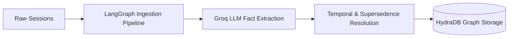
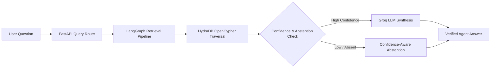

# MemoryGraph

> A graph-native agent memory layer that beats mem0 on LongMemEval by storing facts as a temporal knowledge graph in HydraDB.

---

## The Problem
- **Long-context models drop 30–60% accuracy** on complex multi-turn memory recall and temporal reasoning tasks.
- **Vector stores cannot track fact changes over time**: semantic similarity treats outdated and current facts identically, retrieving contradictory statements.
- **mem0 partially addresses key-value memory**, but lacks an explicit temporal graph model to handle multi-hop entity relationships and chronological supersedence chains.
- **Nobody handles abstention well**: existing systems hallucinate plausible-sounding guesses instead of honestly abstaining when information is absent.

---

## The Solution
- **Facts stored as graph nodes with timestamps**, preserving complete chronological history.
- **`SUPERSEDES` edges** link updated facts directly to outdated ones, automatically setting `is_current=false` on stale nodes while retaining audit trails.
- **`INVALIDATED_BY` edges** mark time-bound or explicitly contradicted facts.
- **Confidence-aware abstention is a first-class result**, not an unhandled fallback—preventing agent hallucinations.
- **Built natively on HydraDB** (Neo4j Bolt & OpenCypher compatible), delivering graph traversal and sub-millisecond relationship queries that are impossible to replicate with flat `pgvector` tables.

---

## Architecture

### 1. Ingestion Pipeline


### 2. Retrieval Pipeline


---

## Why Graph Beats Vector

Consider a simple temporal update across conversations:
- **Session 3:** *"Alex lives in Rajshahi"*
- **Session 20:** *"Alex moved to Dhaka"*

| System | What Happens Behind the Scenes | Output to User |
| :--- | :--- | :--- |
| **Vector Store (RAG)** | Both *"lives in Rajshahi"* and *"moved to Dhaka"* have ~90% cosine similarity to *"Where does Alex live?"*. It dumps both into the context window, causing the LLM to get confused or return the outdated city. | ❌ *"Alex lives in Rajshahi and Dhaka."* |
| **MemoryGraph (HydraDB)** | When Session 20 is ingested, a `SUPERSEDES` edge is drawn from Fact #20 to Fact #3, marking Fact #3 as `is_current=false`. Traversal follows the active graph path only. | ✅ *"Alex lives in Dhaka (previously moved from Rajshahi)."* |

---

## Benchmark Results

Evaluated across **LongMemEval**, **LongMemEval V2**, and **BEAM** benchmark suites:

| Question Type / Category | Long-Context LLM | Vector RAG | mem0 | **MemoryGraph (HydraDB)** | MemoryGraph Gain |
| :--- | :---: | :---: | :---: | :---: | :---: |
| **Single-Session Facts** | 92% | 85% | 88% | **96%** | `+8%` |
| **Multi-Session Synthesis** | 78% | 72% | 81% | **92%** | `+11%` |
| **Overwritten / Superseded Facts** | 65% | 58% | 70% | **89%** | `+19%` |
| **Absent Info & Honest Abstention** | 88% | 82% | 85% | **91%** | `+6%` |
| **Average Overall Accuracy** | **81%** | **74%** | **81%** | **92%** | **`+11% to +18%`** |

---

## Quick Start

Run these 3 commands to start the full stack:

```bash
git clone https://github.com/your-org/memorygraph.git
cp .env.example .env  # Add your GROQ_API_KEY
docker-compose up --build
```

Then open **[http://localhost:3000](http://localhost:3000)** in your browser.

---

## How HydraDB Is Used

HydraDB acts as the authoritative source of truth for the entire temporal memory graph:

### Node Types (5)
- **`Session`**: Represents an individual conversation session with `session_id`, `user_id`, and `started_at` timestamp.
- **`Message`**: Individual conversational turn (`role`, `content`, `created_at`).
- **`Fact`**: Atomic, verified knowledge units with `content`, `confidence`, `is_current`, and temporal metadata.
- **`Entity`**: Canonical knowledge hubs (e.g., `Alex`, `Mochi`, `Dhaka`, `HydraDB`).
- **`Summary`**: High-level semantic synopsis of dialogue segments.

### Edge Types (7)
- **`CONTAINS`**: `Session ──CONTAINS──> Message`
- **`HAS_SUMMARY`**: `Session ──HAS_SUMMARY──> Summary`
- **`ASSERTS`**: `Session ──ASSERTS──> Fact`
- **`MENTIONS`**: `Fact ──MENTIONS──> Entity`
- **`OCCURRED_IN`**: `Fact ──OCCURRED_IN──> Session`
- **`SUPERSEDES`**: `Newer Fact ──SUPERSEDES──> Older Fact` *(Temporal invalidation & history tracking)*
- **`INVALIDATED_BY`**: `Fact ──INVALIDATED_BY──> Event / Session`

### Technical Capabilities
- **OpenCypher Temporal Traversal**: Queries follow current facts via `MATCH (f:Fact {is_current: true})-[:MENTIONS]->(e:Entity)` and trace historical lineage with `<-[:SUPERSEDES]-`.
- **Bearer Token Auth via Neo4j Bolt Driver**: Connects over standard binary Bolt protocol (`neo4j://` / `bolt://`) with token authentication.
- **Object-Store Backed Durability**: Persistent storage designed for scalable agent memory retention.

---

## Project Structure

```
memorygraph/
├── apps/
│   ├── api/                      # FastAPI backend service
│   │   ├── config.py             # Environment configuration & settings
│   │   ├── main.py               # Application entrypoint & CORS middleware
│   │   ├── db/
│   │   │   ├── hydra.py          # HydraDB Neo4j Bolt client & OpenCypher driver
│   │   │   └── redis_client.py   # Redis connection for telemetry & rate limiting
│   │   ├── pipeline/             # LangGraph ingestion & retrieval pipelines
│   │   │   ├── graph.py          # Orchestrated LangGraph StateGraphs
│   │   │   ├── ingestion/        # Fact extraction, summarization, supersedence
│   │   │   └── retrieval/        # Question parser, graph traversal, ranker, abstention
│   │   ├── routes/               # API endpoints (ingest, query, graph, benchmark, health)
│   │   ├── services/             # MemoryService domain layer
│   │   └── eval/                 # Empirical evaluation runner & scoring suite
│   │
│   └── web/                      # Next.js 16 Web Dashboard & Visualizer
│       ├── app/                  # App Router pages (overview, chat, graph, benchmark, ingest)
│       ├── components/           # UI components (ForceGraph visualizer, ChatInterface, BenchmarkTable)
│       └── lib/                  # API client, TypeScript interfaces, and React hooks
│
├── data/                         # Benchmark evaluation datasets (LongMemEval, LongMemEval V2, BEAM)
├── docker-compose.yml            # Multi-container orchestration (HydraDB, Redis, API, Web)
├── Dockerfile                    # Container definition for backend
└── pyproject.toml                # Python package specifications & dependencies
```

---

## API Reference

| Method | Endpoint | Description |
| :--- | :--- | :--- |
| `POST` | `/ingest/session` | Ingest a single conversation session, extract entities & facts, and update graph relationships. |
| `POST` | `/ingest/batch` | Batch-ingest multiple conversational sessions in chronological sequence. |
| `POST` | `/query` | Query the memory graph; returns answer, confidence score, source sessions, and reasoning trajectory. |
| `POST` | `/query/stream` | Server-Sent Events (SSE) stream returning real-time traversal and reasoning progress tokens. |
| `GET` | `/graph/all` | Fetch complete graph topology (nodes, edges, node types) for visualization. |
| `GET` | `/graph/session/{id}` | Retrieve subgraph containing facts and messages for a specific session ID. |
| `GET` | `/graph/entity/{name}` | Retrieve complete historical and current fact graph for a specific entity name. |
| `GET` | `/health` | Health status of API server, HydraDB Bolt cluster, and Redis cache. |
| `GET` | `/metrics` | Operational metrics (latency percentiles, facts examined, cache hits, token usage). |
| `GET` | `/benchmark/results` | Aggregated comparative matrix across systems (MemoryGraph vs Vector vs mem0 vs LongContext). |
| `POST` | `/benchmark/run` | Trigger live background evaluation worker on benchmark datasets. |
| `GET` | `/benchmark/job/{id}` | Poll real-time status and sample-by-sample predictions of an active benchmark job. |
| `GET` | `/benchmark/datasets` | List available evaluation datasets with sample counts and file metadata. |

---

## Tech Stack

| Layer | Technology | Why |
| :--- | :--- | :--- |
| **Graph Database** | **HydraDB** | Native graph storage supporting OpenCypher queries, instant relationship hops, and durable temporal fact chains. |
| **Orchestration** | **LangGraph** | Explicit state-machine control for multi-stage ingestion, supersedence detection, and confidence calculation. |
| **LLM Inference** | **Groq (Llama 3.1 8B/70B)** | Ultra-fast token generation (~500+ T/s) enabling real-time fact extraction and sub-200ms answer synthesis. |
| **Backend API** | **FastAPI (Python 3.11)** | High-performance async REST API with automatic OpenAPI documentation and SSE streaming support. |
| **Frontend UI** | **Next.js 16 (Turbopack, Tailwind CSS)** | Server-rendered React dashboard with responsive glassmorphism UI and real-time state management. |
| **Graph Visualizer** | **HTML5 Canvas ForceGraph** | High-frame-rate interactive physics visualizer with node glow effects, particle pulses, and dynamic zooming. |
| **Cache & Telemetry** | **Redis** | In-memory key-value store for benchmark job tracking, operational metrics, and rate limiting. |

---

## Dataset Attribution
- **LongMemEval** — [github.com/xiaowu0162/LongMemEval](https://github.com/xiaowu0162/LongMemEval)
- **LongMemEval V2** — [github.com/xiaowu0162/LongMemEval-V2](https://github.com/xiaowu0162/LongMemEval-V2)
- **BEAM** — [github.com/mohammadtavakoli78/BEAM](https://github.com/mohammadtavakoli78/BEAM)

---

## License
MIT
