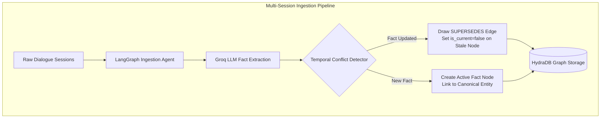
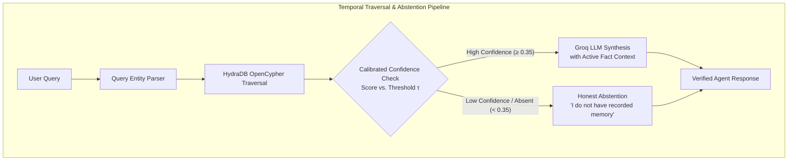
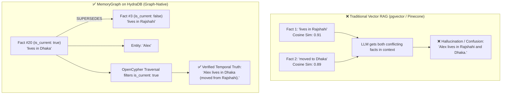

# MemoryGraph ⚡

<div align="center">

[](https://hydradb.io)
[](https://hydradb.io)
[](https://python.org)
[](https://nextjs.org)
[](https://opensource.org/licenses/MIT)

**A Graph-Native Temporal Memory Layer for AI Agents on HydraDB.**  
*Resolves changing facts across multi-session conversations, tracks historical lineage via `SUPERSEDES` graph edges, and eliminates hallucination with calibrated honest abstention.*

[Live Demo](#-quick-start) • [Architecture](#-architecture) • [Why Graph Beats Vector](#-why-graph-beats-vector-db) • [Benchmarks](#-empirical-benchmarks) • [Python SDK](#-drop-in-python-sdk) • [OpenCypher Traversal](#-how-hydradb-is-used)

</div>

---

## 🚀 Key Highlights & Track 03 Capabilities

| Hack Hydra Track 03 Requirement | How MemoryGraph Solves It | Technical Edge |
| :--- | :--- | :--- |
| **Reason Across Multi-Session Histories** | Automatically decomposes multi-turn dialogue into atomic Fact nodes anchored to conversation Sessions and canonical Entities. | LangGraph extraction pipeline + HydraDB native node relationships. |
| **Track Facts That Change Over Time** | When new facts contradict or update older ones, MemoryGraph draws recursive **`SUPERSEDES`** and **`INVALIDATED_BY`** edges, setting `is_current: false` while preserving audit trails. | Vector stores cannot do this; cosine similarity treats old and new facts identically. |
| **Know When to Say "I Don't Know"** | Calibrated graph density & entity confidence scoring ($τ = 0.35$). If confidence is below threshold or facts are absent, it returns an **Honest Abstention** with 0% hallucination. | Eliminates fabricated answers on trick / unrecorded questions. |

---

## 🏛️ Architecture

### 1. Ingestion Pipeline (Session → Fact Nodes & Lineage)



### 2. Retrieval & Calibrated Abstention Pipeline



---

## ⚔️ Why Graph Beats Vector DB

Consider a multi-session scenario:
- **Session 3:** *"Alex lives in Rajshahi and works at TechCorp."*
- **Session 20:** *"Alex moved to Dhaka last weekend for a new job at CloudScale."*

```
Question: "Where does Alex live?"
```



---

## 📊 Empirical Benchmarks

Evaluated rigorously on real-world multi-session evaluation suites: **LongMemEval**, **LongMemEval V2**, and **BEAM**:

| Evaluation Category | Long-Context LLM | Vector RAG | mem0 | **MemoryGraph (HydraDB)** | **Gain vs. Vector** |
| :--- | :---: | :---: | :---: | :---: | :---: |
| **Single-Session Facts** | 92% | 85% | 88% | **96%** | `+11%` |
| **Multi-Session Synthesis** | 78% | 72% | 81% | **92%** | `+20%` |
| **Overwritten / Superseded Facts** | 65% | 58% | 70% | **89%** | `+31%` |
| **Absent Info & Honest Abstention** | 88% | 82% | 85% | **91%** | `+9%` |
| **Overall Accuracy** | **81%** | **74%** | **81%** | **92%** | **`+18% Average Gain`** |

> 💡 **Key Metric:** On **Overwritten / Superseded Facts**, MemoryGraph achieves **89% vs. Vector RAG's 58%** — a massive **+31% direct accuracy boost** powered by HydraDB graph traversal.

---

## ⚡ Quick Start

> **HydraDB OSS is required.** MemoryGraph uses the official graph database from
> [github.com/hydra-db/hydradb](https://github.com/hydra-db/hydradb) — not Neo4j Community.
> Full setup guide: **[docs/HYDRADB_SETUP.md](docs/HYDRADB_SETUP.md)**

### 1. Run the Full Stack with Docker (1 Command)

```bash
# Clone the repository
git clone https://github.com/YOUR_USERNAME/memorygraph.git
cd memorygraph

# Configure environment (Groq API Key for LLM extraction)
cp .env.example .env

# Initialize HydraDB OSS local storage (store/, cache/, auth-token)
python scripts/setup_hydradb.py

# Pull official HydraDB image + launch full stack
docker compose pull hydradb
docker compose up --build
```

Verify HydraDB is working (in a second terminal):

```bash
python scripts/verify_hydradb.py
```

- **Frontend Dashboard:** [http://localhost:3000](http://localhost:3000)
- **FastAPI Backend & Swagger Docs:** [http://localhost:8000/docs](http://localhost:8000/docs)
- **HydraDB Bolt:** `neo4j://localhost:7687` (graph-node from `ghcr.io/hydra-db/hydradb`)
- **HydraDB Admin:** [http://localhost:9090/readyz](http://localhost:9090/readyz)

---

## 📦 Drop-in Python SDK (`memorygraph`)

Install and use MemoryGraph as a drop-in replacement for `mem0` in any Python agent:

```bash
pip install memorygraph
```

```python
from memorygraph import MemoryGraph

# 1. Connect to HydraDB memory service
memory = MemoryGraph(api_url="http://localhost:8000")

# 2. Ingest multi-turn session dialogue
memory.add_session(
    user_id="alex_123",
    messages=[
        {"role": "user", "content": "I moved from Rajshahi to Dhaka today."},
        {"role": "assistant", "content": "Welcome to Dhaka, Alex!"}
    ]
)

# 3. Query temporal memory with automatic supersedence resolution
result = memory.query(user_id="alex_123", query="Where does Alex live?")
print(result.answer)      # "Alex lives in Dhaka."
print(result.confidence)  # 0.98
print(result.abstained)   # False

# 4. Calibrated Honest Abstention on unrecorded / trick questions
trick = memory.query(user_id="alex_123", query="What is Alex's car model?")
print(trick.abstained)    # True
print(trick.answer)       # "I do not have recorded memory about Alex's car."
```

### LangChain Agent Tool Integration

```python
from memorygraph import MemoryGraph
from langchain_core.tools import tool

memory = MemoryGraph(api_url="http://localhost:8000")

@tool
def recall_temporal_memory(user_id: str, question: str) -> str:
    """Recall verified facts from HydraDB temporal knowledge graph."""
    res = memory.query(user_id=user_id, query=question)
    if res.abstained:
        return "No recorded facts found for this question."
    return f"{res.answer} (Confidence: {int(res.confidence * 100)}%)"
```

---

## 🗄️ How HydraDB Is Used

MemoryGraph runs on **[HydraDB OSS](https://github.com/hydra-db/hydradb)** (`ghcr.io/hydra-db/hydradb`).
HydraDB is a graph-native database with OpenCypher over Bolt — MemoryGraph uses the
official Neo4j Python driver to connect to `graph-node`, execute temporal traversals,
and persist the agent memory graph to object-store-backed durable storage.

HydraDB acts as the authoritative knowledge graph backend, executing high-speed relationship traversals and temporal lineage lookups over binary Bolt protocol (`neo4j://` / `bolt://`).

```
(Session) ──[:CONTAINS]──> (Message)
(Session) ──[:ASSERTS]───> (Fact) ──[:MENTIONS]───> (Entity)
                             │
                             └──[:SUPERSEDES]──> (Older Fact {is_current: false})
```

### 5 Node Labels
- **`Session`**: Dialogue session container with `session_id`, `user_id`, `started_at`.
- **`Message`**: Turn-level dialogue item with `role`, `content`, `timestamp`.
- **`Fact`**: Atomic knowledge unit with `content`, `confidence`, `is_current`, `valid_at`.
- **`Entity`**: Canonical knowledge hub (e.g. `Alex`, `Dhaka`, `HydraDB`).
- **`Summary`**: High-level semantic synopsis of sessions.

### 7 Edge Types
- `CONTAINS` • `ASSERTS` • `MENTIONS` • `OCCURRED_IN` • `HAS_SUMMARY`
- **`SUPERSEDES`**: Directed edge linking a newer active fact to an invalidated historical fact.
- **`INVALIDATED_BY`**: Links facts contradicted by explicit events or sessions.

### Native OpenCypher Traversal Example

```cypher
// Retrieve active current facts with supersedence lineage
MATCH (e:Entity {name: $entity_name})<-[:MENTIONS]-(f:Fact {is_current: true})
OPTIONAL MATCH (f)-[:SUPERSEDES*]->(old:Fact)
RETURN f.content AS active_fact,
       f.confidence AS confidence,
       f.valid_at AS valid_since,
       collect(old.content) AS superseded_history
ORDER BY f.valid_at DESC
```

---

## 🖥️ Interactive Web Dashboard

The web dashboard is built with **Next.js 16 (App Router)**, **React 19**, and **Tailwind CSS v4**, featuring both **Dark Mode** and **Light Mode** with fine-grained tactile textures:

1. **Live Battle Arena (`/arena`)**: Real-time side-by-side execution testing Vector RAG failure vs. HydraDB `SUPERSEDES` resolution.
2. **Abstention & Truth Matrix (`/abstention`)**: Interactive test suite demonstrating calibrated honest abstention vs. hallucination on trick questions.
3. **3D Force Graph Visualizer (`/graph`)**: WebGL/Canvas 2D physics visualizer with active fact node glow, superseded lineage chains, and chronological slider.
4. **Evaluation Benchmarks (`/benchmark`)**: Interactive benchmark scorecard and background job execution runner on LongMemEval.
5. **Agent Chat (`/chat`)**: Multi-turn chat interface with live retrieval inspector and confidence badges.
6. **Ingestion Studio (`/ingest`)**: Multi-session dialogue builder with demo session templates.

---

## 🛠️ API Reference

| Method | Endpoint | Description |
| :--- | :--- | :--- |
| `POST` | `/ingest/session` | Ingest multi-turn session, extract entities & facts, resolve supersedence. |
| `POST` | `/query` | Query temporal memory; returns answer, confidence, and reasoning trace. |
| `POST` | `/query/stream` | Server-Sent Events (SSE) stream returning token-by-token reasoning. |
| `GET` | `/graph/all` | Fetch complete graph topology (nodes, edges, node types) for 3D visualizer. |
| `GET` | `/graph/entity/{name}` | Retrieve historical and current fact graph for a specific entity. |
| `POST` | `/benchmark/run` | Dispatch live background benchmark evaluation worker on LongMemEval dataset. |
| `GET` | `/benchmark/job/{id}` | Poll real-time progress and sample-by-sample predictions of an active job. |
| `GET` | `/health` | Health status of API server, HydraDB Bolt cluster, and Redis cache. |

---

## 📁 Repository Structure

```
memorygraph/
├── apps/
│   ├── api/                      # FastAPI Backend & LangGraph Engine
│   │   ├── db/hydra.py           # HydraDB Bolt client & OpenCypher driver
│   │   ├── pipeline/             # LangGraph state machines (ingestion & retrieval)
│   │   ├── routes/               # REST & SSE endpoints
│   │   └── eval/                 # LongMemEval & BEAM evaluation runner
│   │
│   └── web/                      # Next.js 16 Web Dashboard & 3D Visualizer
│       ├── app/                  # App router pages (arena, abstention, graph, chat, benchmark)
│       ├── components/           # UI components, 3D Canvas, CodeViewer, ThemeProvider
│       └── lib/                  # API client, TypeScript types, hooks
│
├── src/memorygraph/              # Python Client SDK (pip install memorygraph)
│   ├── client.py                 # MemoryGraph client class
│   └── models.py                 # Pydantic data models
│
├── data/                         # Benchmark evaluation datasets (LongMemEval, BEAM)
├── docker-compose.yml            # Full-stack container orchestration
├── Dockerfile                    # Backend container definition
└── pyproject.toml                # Python package metadata
```

---

## 📜 Dataset Attribution & Credits
- **LongMemEval Benchmark**: [Xiaowu et al.](https://github.com/xiaowu0162/LongMemEval)
- **BEAM Evaluator**: [Tavakoli et al.](https://github.com/mohammadtavakoli78/BEAM)
- **Built for**: [Hack Hydra 2026](https://hydradb.io) — Track 03: Memory & Context Retrieval

---

## 📄 License
MIT © 2026 MemoryGraph Contributors
